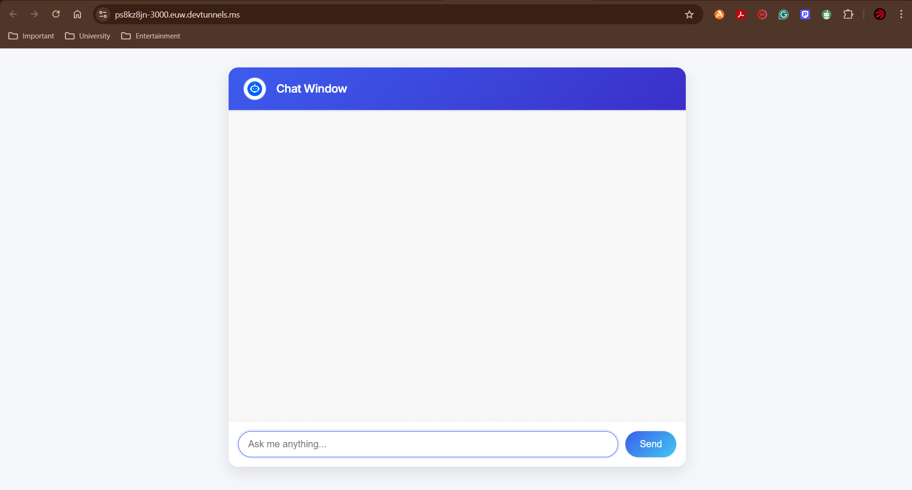
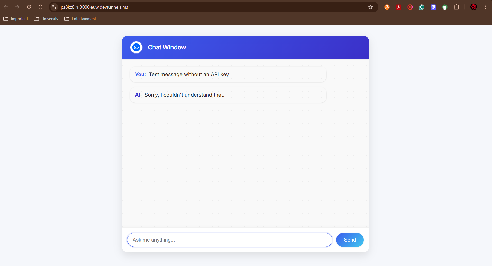

# Software DevAI Chatbot

A simple browser-based chat interface built with **Node.js**, **Express**, and the **OpenAI API**.

---

## 🚀 Features

- Frontend chat UI using HTML, CSS, and vanilla JavaScript.  
- Backend powered by Express to handle message routing.  
- Integrates with OpenAI's GPT models for conversational responses.  
- Easily customizable and extendable.

---

## 🖼️ Screenshots

Below are two examples illustrating how the chatbot appears on a live website:

- **Desktop chat interface**  
  

- **Desktop chat interaction interface**  
  

---

## 🧠 Setup & Installation

### 1. Prerequisites
- [Node.js](https://nodejs.org/) v14+  
- An OpenAI API key (starts with `sk-`), obtained from the OpenAI Dashboard

### 2. Clone the repository
```bash
git clone https://github.com/Rayan-Alam-UOIT/Software-Dev-AI-Chatbot.git
cd Software-Dev-AI-Chatbot
```

### 3. Install dependencies
```bash
npm install
```

### 4. Configure the OpenAI API key
- Create or update ```config.js``` in the project root:
```bash
module.exports = {
  OpenAIAPIKey: 'sk-your_actual_api_key_here'
};
```
- Then import and use it in  ```openai.js ```, for example:
```bash
const { OpenAIAPIKey } = require('./config');
// ...
'Authorization': `Bearer ${OpenAIAPIKey}`,
```
---

## 🌐 Usage

### 1. Start the application:

```bash
node server.js
```

### 2. Open your browser and go to ```http://localhost:3000```

### 3. Type your message and click Send. The bot, through OpenAI, will respond accordingly.

---

## 🛠️ Code Highlights

- ```public/main.js``` – Sends user messages to the server and updates the chat log.

- ```openai.js``` – Handles OpenAI API calls, response parsing, and error handling.

- ```server.js``` – Serves static files and defines the /getChatbotResponse POST route.
